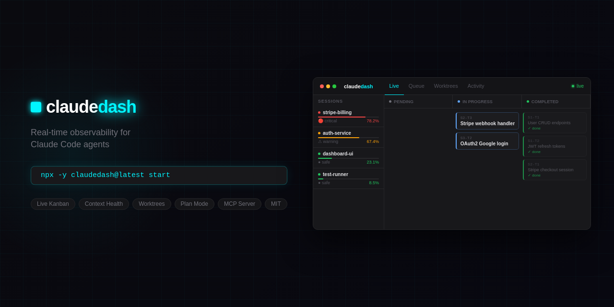
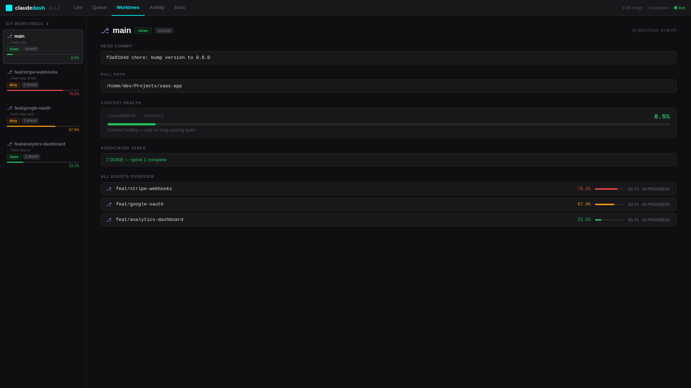
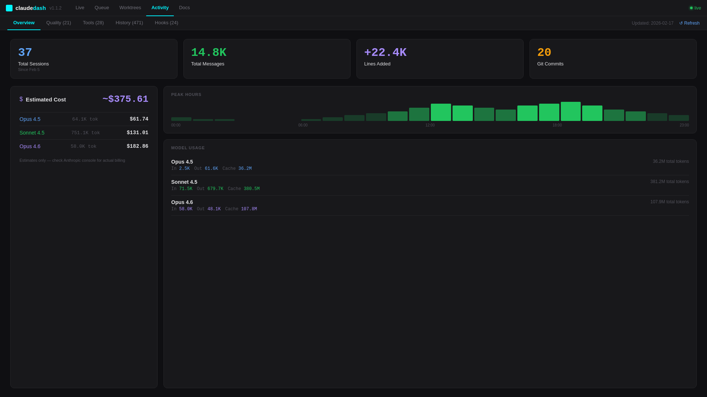
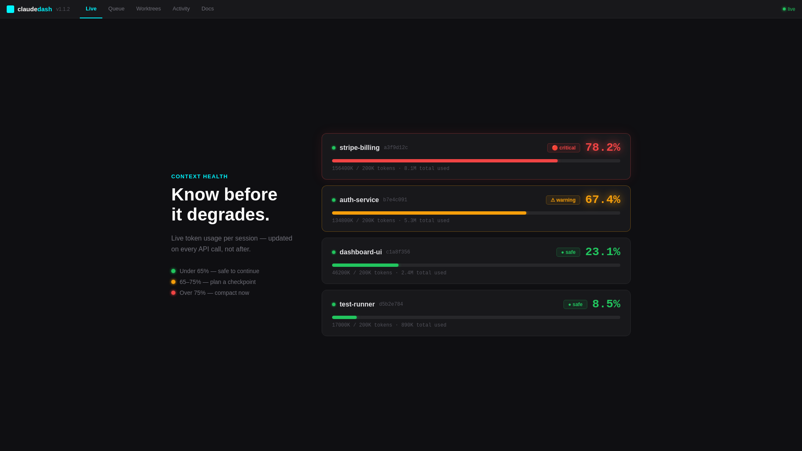
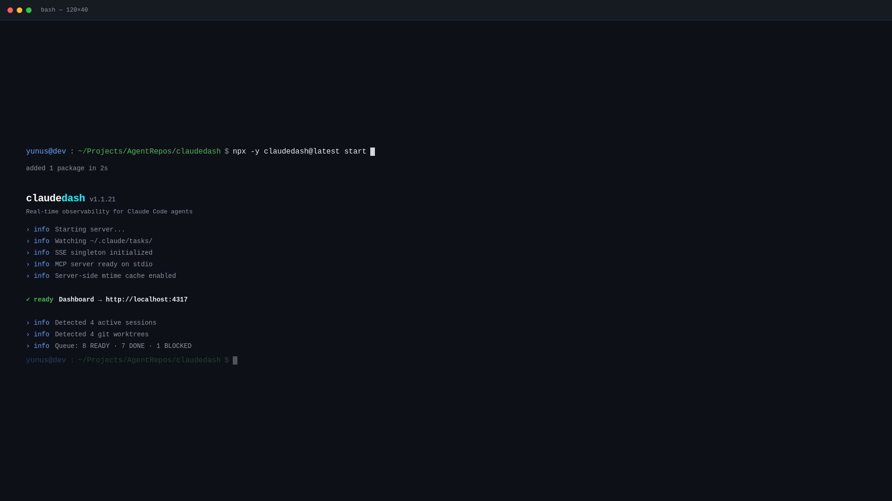

# claudedash

**See exactly what your AI agent is doing — in real time.**

[](https://www.npmjs.com/package/claudedash)
[](https://opensource.org/licenses/MIT)
[](https://github.com/yunusemrgrl/claudedash/actions/workflows/ci.yml)



---

## The Problem

You tell Claude Code: _"refactor the auth system."_ It says: _"on it."_

Terminal scrolls. Minutes pass. Is it on step 3 of 12? Stuck in a loop? Already done?

**You have no idea.**

claudedash fixes that. One command, zero config — a live dashboard for every Claude Code session.

```bash
npx -y claudedash@latest start
```

Open `localhost:4317`. Watch your agent work.

---

## Quick Start

```bash
# Zero-install — always gets the latest version
npx -y claudedash@latest start

# Install lifecycle hooks (recommended)
claudedash hooks install

# Set up plan mode for structured task execution
claudedash init
```

That's it. The dashboard auto-detects your Claude sessions.

---

## Features

- **Live Kanban board** — real-time task status from `~/.claude/tasks/`, updated via SSE within ~100ms
- **Plan mode** — structured execution with dependencies, acceptance criteria, and blocked-task detection
- **Context health** — token usage bar per session, warnings at 65% (warn) and 75% (critical)
- **Quality gates** — lint / typecheck / test results per task with a full timeline history
- **Worktrees** — map parallel agents across git branches, see dirty/ahead/behind at a glance
- **Agent API** — `POST /log`, `POST /agent/register`, heartbeat, BLOCKED → instant browser push notification
- **Hook integration** — PostToolUse/Stop/PreCompact/PostCompact hooks stream every tool call live
- **Cost tracker** — 5-hour rolling billing block estimate per model, real-time
- **MCP server** — `get_queue`, `get_sessions`, `get_cost`, `log_task` — Claude can query its own dashboard
- **Zero infra** — no database, no cloud, reads files from `~/.claude/` directly

---

## Live Mode vs Plan Mode

|                   | **Live Mode**                  | **Plan Mode**                |
| ----------------- | ------------------------------ | ---------------------------- |
| **What**          | Watch Claude work in real time | Structured project execution |
| **Source**        | `~/.claude/tasks/`             | `.claudedash/queue.md`       |
| **Setup**         | None                           | `claudedash init`            |
| **Use when**      | Visibility matters             | Control matters              |
| **Deps / AC**     | —                              | ✓ Full dependency graph      |
| **Execution log** | —                              | ✓ `execution.log`            |

Live mode is on by default. Both modes can run simultaneously.

---

## Screenshots

<table>
  <tr>
    <td align="center" width="50%">
      <br/>
      <sub><b>Live View</b> — Session Kanban + context health per agent</sub>
    </td>
    <td align="center" width="50%">
      <br/>
      <sub><b>Queue</b> — Plan mode task board with dependency graph</sub>
    </td>
  </tr>
  <tr>
    <td align="center" width="50%">
      <br/>
      <sub><b>Worktrees</b> — Parallel agents across git branches</sub>
    </td>
    <td align="center" width="50%">
      <br/>
      <sub><b>Activity</b> — Cost tracker + tool analytics per session</sub>
    </td>
  </tr>
  <tr>
    <td align="center" width="50%">
      <br/>
      <sub><b>Context Health</b> — Live token usage, warnings at 65% / 75%</sub>
    </td>
    <td align="center" width="50%">
      <br/>
      <sub><b>Quick Start</b> — One command, zero config</sub>
    </td>
  </tr>
</table>

---

## Install

```bash
# Zero-install, always latest
npx -y claudedash@latest start

# Or install globally
npm i -g claudedash
claudedash start
```

---

## Plan Mode

Initialize in your project:

```bash
claudedash init
```

This creates `.claudedash/` with:

| File            | Purpose                                               |
| --------------- | ----------------------------------------------------- |
| `queue.md`      | Task list — slices, dependencies, acceptance criteria |
| `workflow.md`   | Execution protocol for your agent                     |
| `execution.log` | Agent logs `DONE` / `FAILED` / `BLOCKED` here         |
| `CLAUDE.md`     | Paste into your project's `CLAUDE.md`                 |

**queue.md format:**

```markdown
# Slice S1

## S1-T1

Area: Backend
Depends: -
Description: Setup database schema
AC: Tables created, migrations run

## S1-T2

Area: Backend
Depends: S1-T1
Description: Implement user auth
AC: Login and registration working
```

Tell your agent:

```
Follow .claudedash/workflow.md, start with S1-T1.
```

---

## CLI

| Command                             | Description                               |
| ----------------------------------- | ----------------------------------------- |
| `claudedash start`                  | Start dashboard (auto-detect modes)       |
| `claudedash start -p 3000`          | Custom port                               |
| `claudedash start --token <secret>` | Enable auth token                         |
| `claudedash init`                   | Init plan mode in current directory       |
| `claudedash hooks install`          | Install PostToolUse/Stop/PreCompact hooks |
| `claudedash status`                 | Single-line terminal summary (no browser) |
| `claudedash doctor`                 | Check setup: hooks, port, version, queue  |
| `claudedash recover`                | Summarize last session after `/clear`     |

---

## Sharing with Your Team

By default claudedash listens on `127.0.0.1` only.

```bash
# Start with a token
claudedash start --token mysecret123

# Or via env
CLAUDEDASH_TOKEN=mysecret123 claudedash start
```

Team access: `http://your-host:4317?token=mysecret123`

> **Tip:** Use a tunnel instead of exposing `--host 0.0.0.0`:
>
> ```bash
> claudedash start --token $(openssl rand -hex 16)
> ngrok http 4317
> ```

---

## Advanced Features

### Context Health

Color-coded token usage per session — green → yellow → red at 65% / 75%.
→ [Context Health docs](docs/context-health.md)

### Quality Gates

Log `lint`, `typecheck`, `test` results per task via `meta.quality` in `execution.log`.
See ✅/❌ inline in each card, with full timeline.
→ [Quality Gates docs](docs/quality-gates.md)

### Worktrees

Running agents across multiple git branches? The Worktrees tab maps sessions to branches by `cwd`, shows dirty/ahead/behind state, and lists which tasks are running where. Native support for `claude --worktree <name>` (creates `.claude/worktrees/<name>/`).
→ [Worktree docs](docs/worktrees.md)

### MCP Server

Claude can query its own dashboard:

```bash
claude mcp add claudedash -- npx -y claudedash@latest mcp
```

Tools: `get_queue`, `get_sessions`, `get_cost`, `get_history`, `log_task`, `create_task`, `register_agent`, `send_heartbeat`.

---

## API

| Endpoint                    | Description                          |
| --------------------------- | ------------------------------------ |
| `GET /health`               | Status, modes, connected clients     |
| `GET /sessions`             | All sessions with context health     |
| `GET /sessions/:id/context` | Session JSONL summary                |
| `GET /events`               | SSE stream                           |
| `GET /snapshot`             | Plan mode state                      |
| `GET /queue`                | Computed task statuses               |
| `GET /worktrees`            | Git worktrees with task associations |
| `GET /billing-block`        | Current 5h billing window            |
| `GET /cost`                 | Estimated cost by model              |
| `POST /log`                 | Log task result                      |
| `POST /plan/task`           | Add task to queue.md                 |
| `POST /agent/register`      | Register an agent                    |

---

## Stack

TypeScript · Fastify · chokidar · SSE · Next.js 16 · Tailwind CSS · Vitest

---

## Development

```bash
git clone https://github.com/yunusemrgrl/claudedash.git
cd claudedash && npm install
cd dashboard && npm install && cd ..

npm run build    # Build core + dashboard
npm test         # Run tests
npm run dev      # Dev server with watch
```

---

## Contributing

PRs welcome. Open an issue first for anything beyond small fixes.
See [CHANGELOG.md](CHANGELOG.md) for release history.

## License

MIT — not affiliated with Anthropic.
