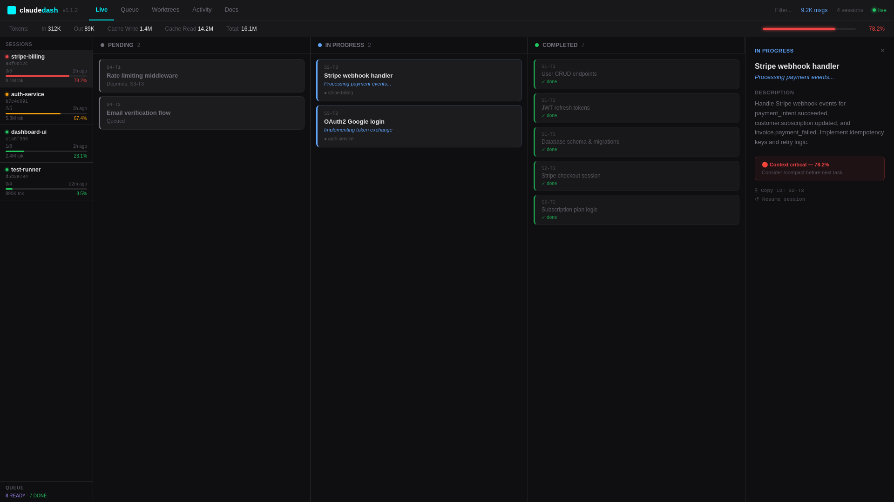
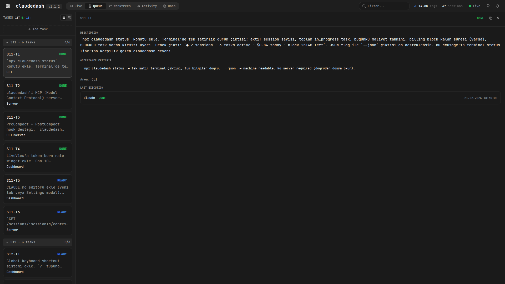
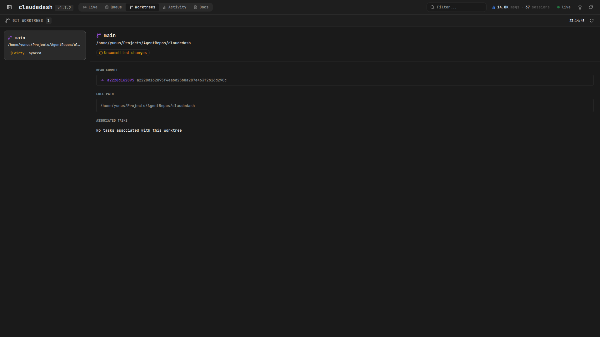
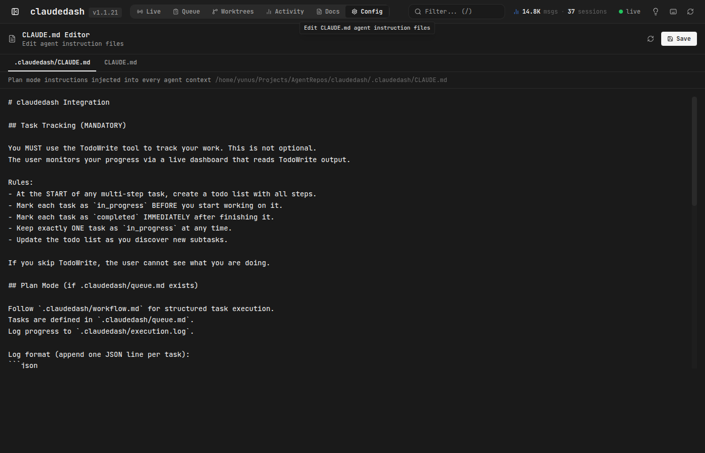
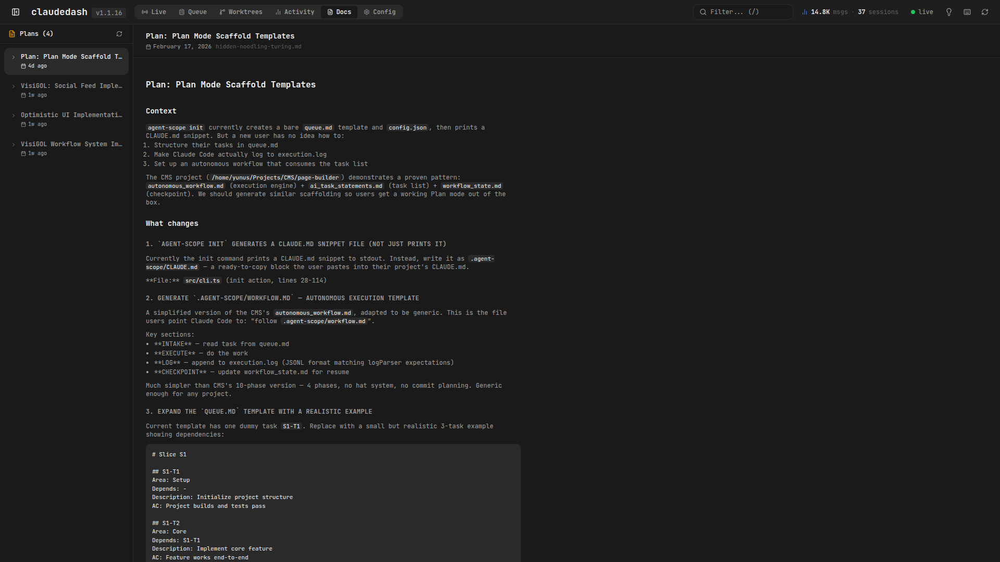

# claudedash

See what your AI agent is actually doing.

[](https://www.npmjs.com/package/claudedash)
[](https://opensource.org/licenses/MIT)
[](https://github.com/yunusemrgrl/claudedash/actions/workflows/ci.yml)

---

## The problem

You tell Claude Code to refactor your auth system. It says "on it." You wait. Terminal scrolls. Minutes pass. You have no idea if it's on task 2 of 12 or stuck in a loop. You're flying blind.

claudedash fixes that. One command, zero config. It reads Claude Code's own task files and gives you a live Kanban board.

```bash
npx -y claudedash@latest start
```

That's it. Open `localhost:4317`. Watch your agent work.


## How it works

Claude Code writes task state to `~/.claude/tasks/` when it uses the TodoWrite tool. claudedash reads those files, watches for changes, and streams updates to your browser via SSE. No database. No auth. No cloud. Just files.

**Important:** Claude Code only writes task files when TodoWrite is actively used. To ensure your sessions always appear on the dashboard, add this to your project's `CLAUDE.md`:

```markdown
You MUST use the TodoWrite tool to track your work.
At the START of any multi-step task, create a todo list with all steps.
Mark each task in_progress before starting, completed after finishing.
```

Or run `claudedash init` — it generates a ready-to-use `CLAUDE.md` snippet.

## Two modes

| | Live | Plan |
|---|---|---|
| **What** | Watch Claude Code work | Structured project planning |
| **Source** | `~/.claude/tasks/` | `.claudedash/queue.md` |
| **Setup** | None | `npx claudedash init` |
| **Use when** | You want visibility | You want control |

Live mode is the default. Plan mode adds dependencies, acceptance criteria, and execution tracking on top.

| Live | Queue | Activity |
|---|---|---|
|  |  |  |

| Worktrees | Config | Docs |
|---|---|---|
|  |  |  |

## Install

```bash
# Zero-install, always latest
npx -y claudedash@latest start

# Or install globally
npm i -g claudedash
claudedash start
```

### Plan mode

For structured project execution with task dependencies and acceptance criteria.

```bash
claudedash init
```

This creates `.claudedash/` with:

| File | Purpose |
|---|---|
| `queue.md` | Your task list — slices, dependencies, AC |
| `workflow.md` | Execution protocol your agent follows |
| `execution.log` | Agent logs DONE/FAILED/BLOCKED here |
| `config.json` | Heading patterns, port, field definitions |
| `CLAUDE.md` | Paste into your project's CLAUDE.md |

Then:

1. Edit `queue.md` with your actual tasks
2. Copy `CLAUDE.md` contents into your project's CLAUDE.md
3. Tell your agent: *"follow .claudedash/workflow.md, start with S1-T1"*
4. Run `claudedash start` and watch the dashboard

## CLI

```bash
claudedash start                          # Auto-detect modes, open dashboard
claudedash start --claude-dir /path       # Custom Claude directory
claudedash start -p 3000                  # Custom port
claudedash start --host 0.0.0.0           # Expose to network (shows warning)
claudedash start --token <secret>         # Enable token auth for sharing
claudedash init                           # Init plan mode in current dir
claudedash recover                        # Summarize last session after /clear
claudedash spec                           # Create spec-mode templates
claudedash worktree create <branch>       # Create isolated worktree
```

## Sharing with your team

By default, claudedash only listens on `127.0.0.1` (localhost). To share the dashboard with a teammate:

```bash
# 1. Start with a secret token
claudedash start --token mysecret123

# Or use an environment variable
CLAUDEDASH_TOKEN=mysecret123 claudedash start
```

Your teammate can then open the dashboard with the token in the URL:

```
http://your-host:4317?token=mysecret123
```

Or pass it as a header:

```bash
curl -H "Authorization: Bearer mysecret123" http://your-host:4317/sessions
```

> **Security:** Never commit your token to git. Use `.env` and add it to `.gitignore`. Consider using a local tunnel like [ngrok](https://ngrok.com) or [cloudflared](https://github.com/cloudflare/cloudflared) rather than exposing `--host 0.0.0.0` directly.
>
> ```bash
> # Share via tunnel without network exposure
> claudedash start --token $(openssl rand -hex 16)
> ngrok http 4317
> ```

## Queue format (Plan mode)

```markdown
# Slice S1

## S1-T1
Area: Backend
Depends: -
Description: Setup database schema
AC: Tables created and migrations run

## S1-T2
Area: Backend
Depends: S1-T1
Description: Implement user authentication
AC: Login and registration endpoints working
```

Validates: required fields, duplicate IDs, unknown deps, circular deps.

## Execution log (Plan mode)

Append-only JSONL:

```json
{"task_id":"S1-T1","status":"DONE","timestamp":"2026-02-16T14:31:22Z","agent":"claude"}
{"task_id":"S1-T2","status":"FAILED","timestamp":"2026-02-16T14:33:10Z","agent":"claude","meta":{"reason":"timeout"}}
{"task_id":"S1-T3","status":"BLOCKED","reason":"API key missing","timestamp":"2026-02-16T14:35:00Z","agent":"claude"}
```

## Observability Features

### Quality Gates

Track lint, typecheck, and test results per task and view them as a timeline in the Plan mode dashboard.

Log quality results in `execution.log`:

```json
{
  "task_id": "F1-2",
  "status": "DONE",
  "timestamp": "2026-02-18T12:05:00Z",
  "agent": "claude",
  "meta": {
    "file": "src/core/logParser.ts",
    "quality": { "lint": true, "typecheck": true, "test": false }
  }
}
```

Select any task in Plan mode to see its quality check history with pass/fail badges. → [Quality Gates docs](docs/quality-gates.md)

### Context Health

See how much of Claude's context window each session is using, with color-coded warnings at 65% (warn) and 75% (critical).

- Session cards show a compact `72%` indicator
- Selected session shows a full progress bar in the token header
- A header banner appears when any session crosses warn/critical level

→ [Context Health docs](docs/context-health.md) | [Estimation methodology](docs/context-estimation.md)

### Worktree Observability

When running agents across multiple git worktrees in parallel, the new **Worktrees** tab shows:

- Branch name and HEAD commit per worktree
- Dirty/clean status (uncommitted changes)
- Ahead/behind commits relative to upstream
- Which agent tasks are running in each worktree

→ [Worktree docs](docs/worktrees.md)

## API

| Endpoint | Description |
|---|---|
| `GET /health` | Status + available modes + `connectedClients` + `lastSessions` |
| `GET /sessions` | All Claude Code sessions (includes `contextHealth`) |
| `GET /sessions/:id` | Tasks for a session |
| `GET /events` | SSE stream |
| `GET /snapshot` | Plan mode state |
| `GET /quality-timeline` | Quality check events (filter with `?taskId=` or `?file=`) |
| `GET /worktrees` | Git worktrees with task associations |
| `GET /claude-insights` | Claude usage report (sandboxed HTML) |
| `POST /plan/task` | Add a task to queue.md |
| `PATCH /plan/task/:id` | Update task status (DONE / BLOCKED / FAILED) |

## Development

```bash
git clone https://github.com/yunusemrgrl/claudedash.git
cd claudedash && npm install
cd dashboard && npm install && cd ..

npm run build        # Build core + dashboard
npm test             # 165 tests
npm run dev          # Dev server with watch
```

## Stack

TypeScript, Fastify, chokidar, SSE, Next.js, Tailwind, Vitest.

## Contributing

PRs welcome. Open an issue first for anything beyond small fixes. See [CHANGELOG.md](CHANGELOG.md) for release history.

## License

MIT
