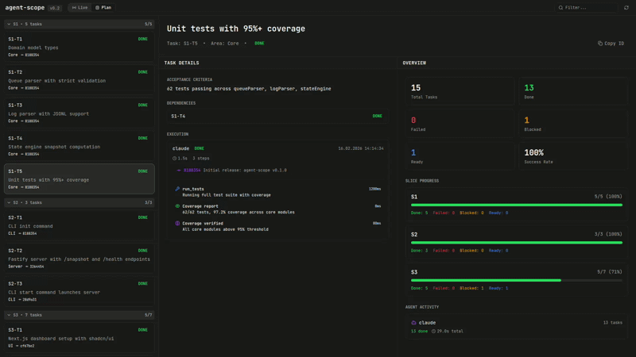
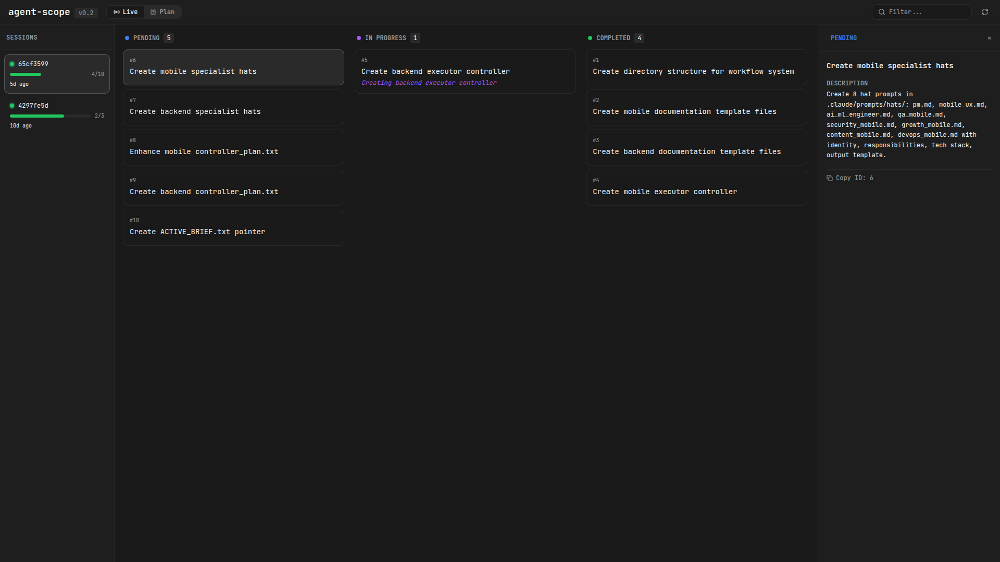
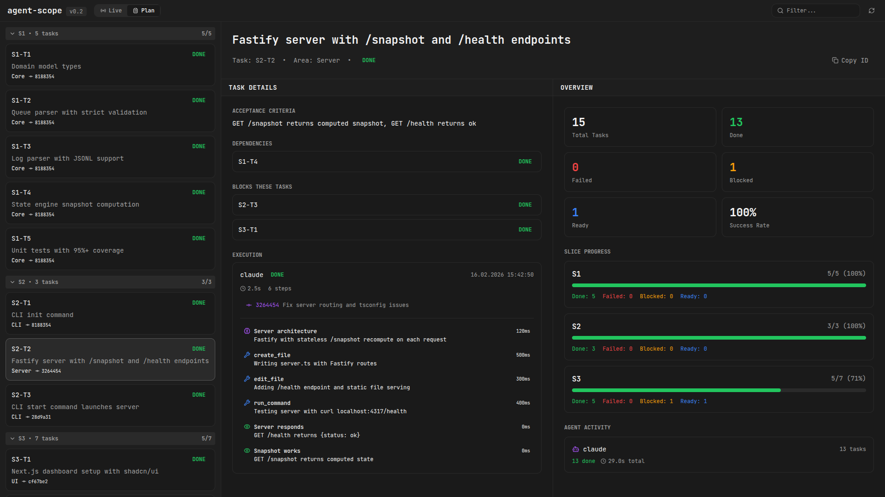

# agent-scope

See what your AI agent is actually doing.

[](https://www.npmjs.com/package/agent-scope)
[](https://opensource.org/licenses/MIT)
[](CHANGELOG.md)

---

## The problem

You tell Claude Code to refactor your auth system. It says "on it." You wait. Terminal scrolls. Minutes pass. You have no idea if it's on task 2 of 12 or stuck in a loop. You're flying blind.

agent-scope fixes that. One command, zero config. It reads Claude Code's own task files and gives you a live Kanban board.

```bash
npx agent-scope start
```

That's it. Open `localhost:4317`. Watch your agent work.



## How it works

Claude Code writes task state to `~/.claude/tasks/` when it uses the TodoWrite tool. agent-scope reads those files, watches for changes, and streams updates to your browser via SSE. No database. No auth. No cloud. Just files.

**Important:** Claude Code only writes task files when TodoWrite is actively used. To ensure your sessions always appear on the dashboard, add this to your project's `CLAUDE.md`:

```markdown
You MUST use the TodoWrite tool to track your work.
At the START of any multi-step task, create a todo list with all steps.
Mark each task in_progress before starting, completed after finishing.
```

Or run `agent-scope init` — it generates a ready-to-use `CLAUDE.md` snippet.

## Two modes

| | Live | Plan |
|---|---|---|
| **What** | Watch Claude Code work | Structured project planning |
| **Source** | `~/.claude/tasks/` | `.agent-scope/queue.md` |
| **Setup** | None | `npx agent-scope init` |
| **Use when** | You want visibility | You want control |

Live mode is the default. Plan mode adds dependencies, acceptance criteria, and execution tracking on top.

| Live mode | Plan mode |
|---|---|
|  |  |

## Install

```bash
# Run directly
npx agent-scope start

# Or install globally
npm i -g agent-scope
```

### Plan mode

For structured project execution with task dependencies and acceptance criteria.

```bash
agent-scope init
```

This creates `.agent-scope/` with:

| File | Purpose |
|---|---|
| `queue.md` | Your task list — slices, dependencies, AC |
| `workflow.md` | Execution protocol your agent follows |
| `execution.log` | Agent logs DONE/FAILED/BLOCKED here |
| `config.json` | Heading patterns, port, field definitions |
| `CLAUDE.md` | Paste into your project's CLAUDE.md |

Then:

1. Edit `queue.md` with your actual tasks
2. Copy `CLAUDE.md` contents into your project's CLAUDE.md
3. Tell your agent: *"follow .agent-scope/workflow.md, start with S1-T1"*
4. Run `agent-scope start` and watch the dashboard

## CLI

```bash
agent-scope start                          # Auto-detect modes, open dashboard
agent-scope start --claude-dir /path       # Custom Claude directory
agent-scope start -p 3000                  # Custom port
agent-scope init                           # Init plan mode in current dir
```

## Queue format (Plan mode)

```markdown
# Slice S1

## S1-T1
Area: Backend
Depends: -
Description: Setup database schema
AC: Tables created and migrations run

## S1-T2
Area: Backend
Depends: S1-T1
Description: Implement user authentication
AC: Login and registration endpoints working
```

Validates: required fields, duplicate IDs, unknown deps, circular deps.

## Execution log (Plan mode)

Append-only JSONL:

```json
{"task_id":"S1-T1","status":"DONE","timestamp":"2026-02-16T14:31:22Z","agent":"claude"}
{"task_id":"S1-T2","status":"FAILED","timestamp":"2026-02-16T14:33:10Z","agent":"claude","meta":{"reason":"timeout"}}
{"task_id":"S1-T3","status":"BLOCKED","reason":"API key missing","timestamp":"2026-02-16T14:35:00Z","agent":"claude"}
```

## New in v0.5.0 — Observability Features

### Quality Gates

Track lint, typecheck, and test results per task and view them as a timeline in the Plan mode dashboard.

Log quality results in `execution.log`:

```json
{
  "task_id": "F1-2",
  "status": "DONE",
  "timestamp": "2026-02-18T12:05:00Z",
  "agent": "claude",
  "meta": {
    "file": "src/core/logParser.ts",
    "quality": { "lint": true, "typecheck": true, "test": false }
  }
}
```

Select any task in Plan mode to see its quality check history with pass/fail badges. → [Quality Gates docs](docs/quality-gates.md)

### Context Health

See how much of Claude's context window each session is using, with color-coded warnings at 65% (warn) and 75% (critical).

- Session cards show a compact `72%` indicator
- Selected session shows a full progress bar in the token header
- A header banner appears when any session crosses warn/critical level

→ [Context Health docs](docs/context-health.md) | [Estimation methodology](docs/context-estimation.md)

### Worktree Observability

When running agents across multiple git worktrees in parallel, the new **Worktrees** tab shows:

- Branch name and HEAD commit per worktree
- Dirty/clean status (uncommitted changes)
- Ahead/behind commits relative to upstream
- Which agent tasks are running in each worktree

→ [Worktree docs](docs/worktrees.md)

## API

| Endpoint | Description |
|---|---|
| `GET /health` | Status + available modes |
| `GET /sessions` | All Claude Code sessions (includes `contextHealth`) |
| `GET /sessions/:id` | Tasks for a session |
| `GET /events` | SSE stream |
| `GET /snapshot` | Plan mode state |
| `GET /quality-timeline` | Quality check events (filter with `?taskId=`) |
| `GET /worktrees` | Git worktrees with task associations |

## Development

```bash
git clone https://github.com/yunusemrgrl/agent-scope.git
cd agent-scope && npm install
cd dashboard && npm install && cd ..

npm run build        # Build core + dashboard
npm test             # 163 tests
npm run dev          # Dev server with watch
```

## Stack

TypeScript, Fastify, chokidar, SSE, Next.js, Tailwind, Vitest.

## License

MIT
